# NPO Finance Suite — User Manual

This is the user manual for the NPO (Non-Profit Organization) Finance Suite. It documents the whole
application page by page, with step-by-step instructions and screenshots. Each
functional area is written up as its own section; sections are added over time,
so some are marked *coming soon* below.

- **Application address:** `http://localhost:8090/`
- **Reporting framework:** IFRS · KES functional

---

## About the application

The NPO Finance Suite is a fund-accounting system for a non-profit organization
that reports under **IFRS** with the Kenya Shilling (**KES**) as its functional
currency. It
covers the full accounting cycle — chart of accounts, general ledger, journals,
payables, receivables, procurement, bank reconciliation, fixed assets, payroll
and staff advances — together with fund and grant management, budgets, donor
reporting, a cashflow forecast, financial statements and system settings.

Two principles run through the whole application:

- **Segregation of duties (the two-person rule).** The person who prepares a
  transaction cannot approve it; approval and posting come from a second person.
  The interface says so plainly whenever an action is blocked for this reason.
- **The ledger is the source of truth.** Subsidiary records (the asset register,
  payroll, advances, donor claims) are reconciled back to their control accounts,
  and the screens show whether they agree.

### How the screens are built

Every page shares a common shell (a left sidebar and a top bar). The body of each
page is rendered in your browser and shows the same building blocks throughout:

- **Stat cards** — a row of headline figures.
- **Tabs** — status filters such as *All*, *Draft*, *Approved*.
- **Tables** — the working list for each area, usually ten rows a page.
- **Drawers** — dialogs that open in the middle of the screen to show or edit one record.
- **Modals** — centred dialogs for building a new record.
- **Toasts** — brief confirmations after an action.

---

## Getting started

### Signing in and the workspace

1. Open the application's address in your browser (for example
   `http://localhost:8090/`). You are taken to **Sign in**.
2. Enter your email and password and choose **Sign in**.
3. Give your **second step**: the six-digit code your authenticator app shows, or
   the code just emailed to you.
4. The application opens on the **Dashboard** (Finance overview), or on the page
   you were trying to open.

**Your first time.** Your invitation email has a link. Open it, choose a password
of at least 12 characters (a few unrelated words are easy to remember), then set
up a second step:

- **Authenticator app** (recommended). Install Google Authenticator, Microsoft
  Authenticator, Okta Verify or similar on your phone, add an account, scan the
  QR code on screen (or type the key under it), and enter the code the app shows.
- **Code by email.** A code is sent to you; enter it. You'll get a new one each
  time you sign in.

You are then shown ten **recovery codes**. Save them somewhere safe, away from
your phone: copy them into a password manager, download them or print them. Each
one gets you in once if you lose your phone or can't reach your email. They are
not shown again.

**Trouble signing in**

| What happened | What to do |
|---|---|
| Forgot your password | **Forgot your password?** on the sign-in page emails a link that works for an hour |
| Lost your phone | **Use a recovery code** on the second-step screen, then set up the app again under **My account** |
| Lost your phone and your recovery codes | Ask whoever manages users to **Reset second step** for you |
| *Too many wrong passwords* | The account is locked for 15 minutes. Wait, or reset your password |
| Signed out while working | You're signed out after 30 minutes without using the application. Sign in again and you return to the same page |

### My account

Open the user menu (your initials, top right) and choose **My account**. Here you
can see which roles you hold and what they let you do, change your password, set
up or change your second step, make new recovery codes (the old ones stop
working), and check your recent sign-ins. If one isn't you, change your password
and tell whoever manages users. **Sign out** is in the same menu.

### The navigation sidebar

The left sidebar lists every page, grouped into four sections:

| Group | Pages |
|-------|-------|
| **Overview** | Dashboard, Period close |
| **Accounting** | Chart of accounts, Programmes, General ledger, Journals, Payables, Receivables, Procurement, Bank reconciliation, Asset register, Asset verification, Payroll, Staff advances |
| **Funds and grants** | Funds, Grants and awards, Budgets, Donor reports |
| **Insight** | Cashflow forecast, Reports, Settings |

Use the collapse toggle (‹ / ›) at the top of the sidebar to shrink it to icons
only; hover an icon to see its label. The sidebar footer shows the reporting
framework, **IFRS · KES functional**.

### The top bar

Running left to right across the top of every page:

- **Breadcrumb** — the current group and page.
- **Interface language** — switches the language of the interface text only;
  posted amounts, dates and account codes are unchanged.
- **Entity picker** — switches between entities, or a consolidated view.
- **Search everything (⌘K)** — a command palette that searches journals,
  accounts, suppliers, donors and awards.
- **Financial-year pill** — the current FY and whether it is open.
- **Notifications (◎)** — a bell with an unread badge; the panel links each item
  to its record.
- **User menu** — who you are signed in as and your roles, **My account** and
  **Sign out**.

---

## Table of contents

General:

- [About the application](#about-the-application)
- [Getting started](#getting-started)
- [Supporting documents](#supporting-documents)

Pages, in sidebar order. ✅ means the section is written; *coming soon* means it
is planned.

| Group | Page | Status |
|-------|------|--------|
| Overview | [Dashboard (Finance overview)](#dashboard-finance-overview) | ✅ |
| Overview | [Period close](#period-close) | ✅ |
| Accounting | [Chart of accounts](#chart-of-accounts) | ✅ |
| Accounting | Programmes | Coming soon |
| Accounting | General ledger | Coming soon |
| Accounting | Journals | Coming soon |
| Accounting | Payables | Coming soon |
| Accounting | Receivables | Coming soon |
| Accounting | Procurement | Coming soon |
| Accounting | Bank reconciliation | Coming soon |
| Accounting | Asset register | Coming soon |
| Accounting | Asset verification | Coming soon |
| Accounting | Payroll | Coming soon |
| Accounting | Staff advances | Coming soon |
| Funds and grants | Funds | Coming soon |
| Funds and grants | Grants and awards | Coming soon |
| Funds and grants | Budgets | Coming soon |
| Funds and grants | Donor reports | Coming soon |
| Insight | Cashflow forecast | Coming soon |
| Insight | Reports | Coming soon |
| Insight | Settings | Coming soon ([Users and roles](#users-and-roles) ✅) |

> For a page-by-page overview of the entire interface, see
> [`documentation.md`](documentation.md).

---

## Dashboard (Finance overview)

The Dashboard is the landing page. It is a finance "cockpit" that answers four
questions at a glance: what needs a decision from you, how the grants are
burning, where the money sits, and whether the books hold together. Everything on
it is drawn live from the ledger.

- **Page:** *Dashboard* (`http://localhost:8090/`)

### 1. Getting to the page

The Dashboard opens automatically when you sign in. From anywhere else, click
**Dashboard** at the top of the sidebar (under **Overview**).

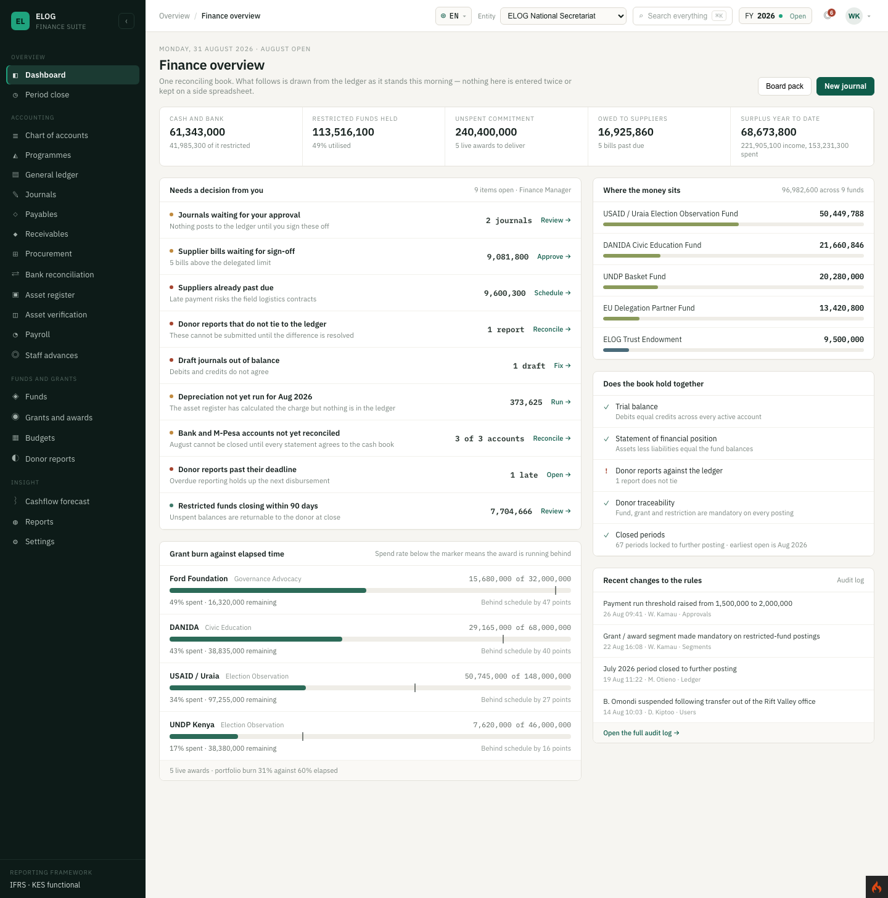

### 2. Reading the header and headline figures

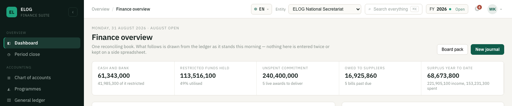

At the top:

- **Kicker** — today's date and whether the month is open (e.g.
  *Monday, 31 August 2026 · August open*).
- **Title** — *Finance overview* — with a one-line summary beneath it.
- **Board pack** button — opens a governance summary drawer (see §7).
- **New journal** button — opens the journal editor to post an entry (see §8).

Below the header is a row of **stat cards** with the headline position, such as
Cash and bank, Restricted funds held, Unspent commitment, Owed to suppliers and
Surplus year to date. Each card carries a short note (for example, how much of
cash is restricted, or how many bills are past due).

### 3. Needs a decision from you

The top-left card is your work queue — the items waiting on your action. Its
subtitle shows how many are open and the role you are acting as.

Each row shows a coloured status dot, a title, a short detail line, a value, and
a call-to-action link (for example *Review →*, *Approve →*, *Schedule →*,
*Reconcile →*, *Fix →*, *Run →*). Typical items include journals awaiting
approval, supplier bills above the delegated limit, suppliers past due, donor
reports that do not tie to the ledger, draft journals out of balance,
depreciation not yet run, and bank accounts not yet reconciled.

**To act on an item:** click its row (or the call-to-action link). You are taken
to the exact page where the work is done. When nothing is waiting, the card reads
*"Nothing is waiting on you."*

### 4. Grant burn against elapsed time

The lower-left card compares how much of each award has been spent against how
much of its period has elapsed. Each award shows the funder, the programme, the
money spent of the total, a **burn bar**, and an **elapsed-time marker**. When the
spend rate sits below the marker, the award is running behind, and the row says
so (for example, *"Behind schedule by 47 points"*). The footer summarises the
portfolio, e.g. *"5 live awards · portfolio burn 31% against 60% elapsed"*.

**To see an award in detail:** click its row to open **Grants and awards** filtered
to that award.

### 5. Where the money sits

The top-right card lists fund balances with a proportion bar for each, and a
heading total (e.g. *"96,982,600 across 9 funds"*).

**To open a fund:** click its row.

### 6. Does the book hold together

The middle-right card is a set of integrity checks, each marked **✓** (in order)
or **!** (needs attention) with a short note — for example the trial balance, the
statement of financial position, donor reports tying to the ledger, donor
traceability and closed periods. Click any check to jump to where it can be
investigated.

Below it, **Recent changes to the rules** shows a short audit-log feed of
configuration changes, with **Open the full audit log →** linking to
*Settings → Audit log*.

### 7. Producing the board pack

The board pack is a governance-level summary for the Board of Trustees.

1. Click **Board pack** (top right). A drawer opens in the middle of the screen.

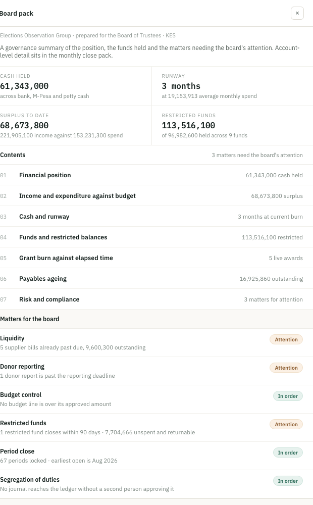

2. Review the drawer:
   - **Headline cells** — the position at a glance (e.g. Cash held, Runway,
     Surplus to date, Restricted funds).
   - **Contents** — a numbered list of the pack's sections, each with its headline
     figure, and a note of how many matters need the board's attention.
   - **Matters for the board** — a risk list, each tagged **In order** or
     **Attention** (for example liquidity, donor reporting, budget control,
     restricted funds, period close and segregation of duties).
3. Click **Print** to open the print dialog (choose *Save as PDF* there to export).
4. Press **Esc** or click **×** to close the drawer.

### 8. Posting a new journal

**New journal** opens the shared journal editor as a drawer. Enter the narration,
period, date, type and lines, attach any supporting evidence, and save the draft
or submit it for approval. When you save from the Dashboard, you are taken to the
**Journals** page where the entry now lives. (The journal editor is documented in
full in the Journals section — *coming soon*.)

### 9. Quick reference

| I want to… | Do this |
|------------|---------|
| Open the Dashboard | Sidebar → **Overview** → **Dashboard** (or sign in) |
| See what needs my action | Read the **Needs a decision from you** queue |
| Act on a queue item | Click the row / its call-to-action link |
| Check whether an award is on track | **Grant burn** card → compare the bar to the marker |
| See fund balances | **Where the money sits** card |
| Confirm the books are consistent | **Does the book hold together** card (✓ / !) |
| Brief the board | **Board pack** → **Print** (or Save as PDF) |
| Post an entry | **New journal** |

---

## Period close

This section walks you step by step through closing an accounting period,
reopening one, and producing the close pack. It is written for the people who run
the month end: accountants who prepare, and the Finance Manager and Executive
Director who confirm and authorise.

- **Page:** *Period close* (`http://localhost:8090/period-close`)

### 1. What this page is for

Closing a period **locks it against further posting**. Once a month is closed, no
journal can be posted into it and the balances carried forward are fixed. Because
that is hard to undo, the page makes you settle a checklist of controls first:

- **Ledger checks** are answered for you automatically from the accounts (for
  example, whether the trial balance is in balance). You cannot tick these — you
  fix the underlying issue and they turn green on their own.
- **Confirmations** are ticked by the named person who did the work (for example,
  the Finance Manager confirming they reviewed the management accounts).

A period can only be closed when **every** item is settled.

---

### 2. Getting to the page

1. Sign in and open `http://localhost:8090/`.
2. In the left sidebar, under **Overview**, click **Period close**.

The page opens on the earliest month that is still open for posting.

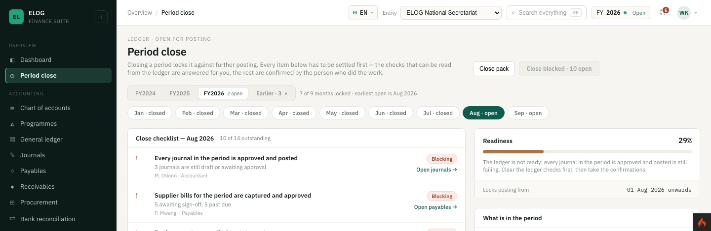

At the top you will see:

- **A kicker** reading either `LEDGER · OPEN FOR POSTING` or `LEDGER · CLOSED`,
  telling you the state of the selected month at a glance.
- **Close pack** button — assembles the evidence bundle for the period (see §7).
- **The close button** — labelled **Close \<month>** when the period is ready, or
  **Close blocked · N open** (greyed) when items are still outstanding. On a
  closed month this is replaced by **Reopen \<month>**.

---

### 3. Choosing the year and month

Two rows of selectors sit under the page title.

- **Year row:** the recent financial years (e.g. `FY2024`, `FY2025`, `FY2026`),
  with a count of open months on the current year, plus an **Earlier · N ▼**
  dropdown for older years. The note to the right summarises progress, e.g.
  *"7 of 9 months locked · earliest open is Aug 2026"*.
- **Month row:** every month with its state, e.g. `Jul · closed`, `Aug · open`.
  The selected month is highlighted.

**To change the period:**

1. Click a **year** to switch financial years (the earlier-years list opens with
   **Earlier · N ▼**).
2. Click a **month** to load its checklist.

Your selection is kept in the address bar, so reloading the page returns you to
the same month.

---

### 4. Reading the close checklist

The main panel is the **Close checklist** for the selected month. Its heading
shows how many items are still outstanding, e.g. *"10 of 14 outstanding"*.

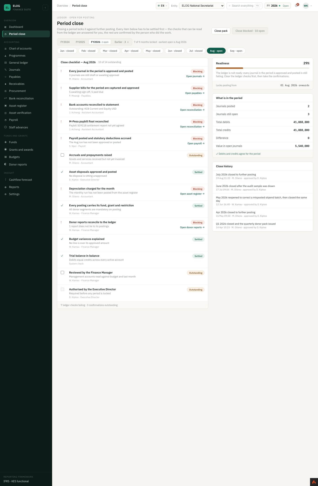

Each row shows:

| Element | Meaning |
|---------|---------|
| **✓ (green)** | A ledger check that is **settled**. |
| **! (red)** | A ledger check that is **blocking** — the ledger does not yet satisfy it. |
| **Checkbox** | A **confirmation** to be ticked by the named owner. Disabled (greyed) if it is not your task or if the period is already locked. |
| **Label + note** | What the control is, and its current ledger reading. |
| **Owner** | The person responsible (e.g. *M. Otieno · Accountant*). |
| **Status pill** | **Settled**, **Blocking**, or **Outstanding**. |
| **Link (→)** | Jumps to the page where you fix the issue (e.g. *Open journals →*, *Open payables →*, *Open reconciliation →*). |

The footer summarises what remains, e.g. *"7 ledger checks failing · 3
confirmations outstanding"*.

Typical checklist items include: every journal approved and posted; supplier
bills captured and approved; bank and M-Pesa accounts reconciled; payroll posted
and statutory deductions accrued; accruals and prepayments raised; depreciation
charged; every posting carries its fund, grant and restriction; donor reports
reconcile to the ledger; budget variances explained; trial balance in balance;
reviewed by the Finance Manager; authorised by the Executive Director.

---

### 5. Working through the checklist step by step

**Step 1 — Clear the ledger checks first.**
For each item showing a red **!** and a **Blocking** pill, click its link (e.g.
*Open journals →*) to go to the relevant module, fix the underlying issue (approve
the draft journal, reconcile the account, post the depreciation run, and so on),
then return to Period close. The check re-reads the ledger and turns green when
it is satisfied.

> Tip: the **Readiness** note on the right tells you the current blocker in plain
> language, e.g. *"The ledger is not ready: every journal in the period is
> approved and posted is still failing. Clear the ledger checks first, then take
> the confirmations."*

**Step 2 — Take the confirmations.**
Once the ledger checks are green, the responsible people tick their confirmation
boxes (for example, *Reviewed by the Finance Manager* and *Authorised by the
Executive Director*).

- To record a confirmation, click its **checkbox**. The tick is saved
  immediately and a brief toast confirms it.
- You can only tick a box that belongs to your role. Boxes for other people are
  disabled, with a tooltip naming the owner.

**Step 3 — Watch readiness reach 100%.**
As items settle, the **Readiness** percentage and progress bar climb. The close
button stays blocked until every item is settled.

---

### 6. Monitoring readiness and period totals

The right-hand column gives you three at-a-glance cards.

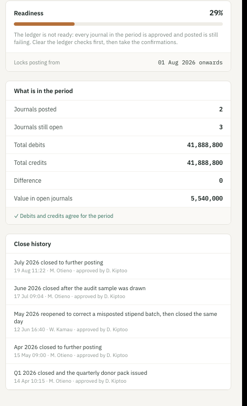

- **Readiness** — a percentage and progress bar (green when done, amber when
  blocked), a plain-language note on what is still failing, and the date posting
  will be **locked from**.
- **What is in the period** — journals posted, journals still open, total debits,
  total credits, the difference, and the value sitting in open journals. A line
  at the foot confirms *"✓ Debits and credits agree for the period"* (or warns if
  they do not).
- **Close history** — a log of previous closes and reopens, each with the date,
  who did it and who approved it.

---

### 7. Producing the close pack

The close pack is the evidence bundle for the period — the statements and
schedules an auditor or the board would expect.

1. Click **Close pack** (top right). A drawer opens in the middle of the screen.

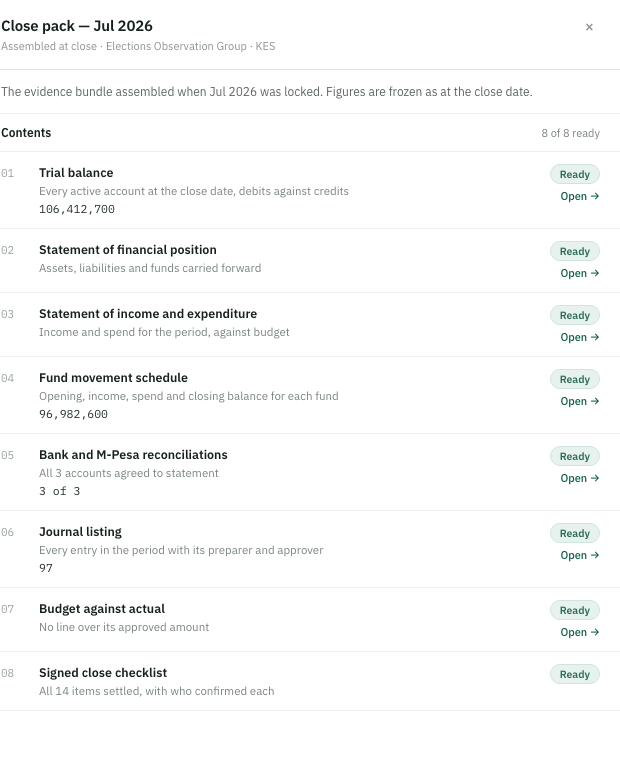

2. Review the **Contents**. The header shows how many are ready, e.g.
   *"5 of 8 ready"*. Each document carries a **Ready** or **Outstanding** pill and,
   where relevant, a headline figure and an **Open →** link. The pack includes:
   1. Trial balance
   2. Statement of financial position
   3. Statement of income and expenditure
   4. Fund movement schedule
   5. Bank and M-Pesa reconciliations
   6. Journal listing
   7. Budget against actual
   8. Signed close checklist
3. To output the pack:
   - **Print** — opens your browser's print dialog with the full pack laid out.
   - **Export PDF** — the same, but the document is titled as a close pack for
     the selected month; choose **Save as PDF** as the destination in the print
     dialog.

> You can assemble and print the pack even when some documents are still
> **Outstanding** — the footer warns that in that case the pack should not be
> circulated until the outstanding items are settled.

4. Press **Esc** or click the **×** to close the drawer.

---

### 8. Closing the period

Once **Readiness is 100%** and every checklist item is settled:

1. Confirm the close button reads **Close \<month>** (green). If it still reads
   **Close blocked · N open**, clicking it only shows a toast naming how many
   items remain and the first blocker — return to §5 and settle them.
2. Click **Close \<month>**.
3. The month is locked. Its state changes to **closed**, Readiness shows **100%**,
   posting is **Locked**, and a new entry appears in **Close history**.

---

### 9. Reopening a closed period

Reopening is occasionally necessary — for example, to correct a misposted batch.
It is recorded on the audit trail.

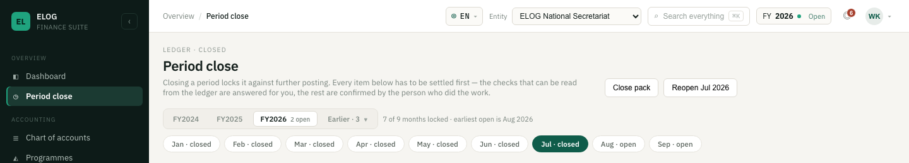

1. Select the closed month you need to reopen.
2. Click **Reopen \<month>** (top right).
3. When prompted *"Why is \<month> being reopened?"*, type the reason. It is kept
   in the audit log.
4. Confirm. The period reopens for posting, and the reason and who reopened it
   are recorded in **Close history**.

> Only reopen when necessary, and close the period again as soon as the
> correction is posted. Reopening a period that has already been reported on can
> change figures others rely on.

---

### 10. Quick reference

| I want to… | Do this |
|------------|---------|
| Open the page | Sidebar → **Overview** → **Period close** |
| Switch year / month | Click a year, then a month, in the selector rows |
| See why I cannot close | Read the **Readiness** note and the **Blocking** / **Outstanding** pills |
| Fix a blocking item | Click its link (e.g. *Open journals →*), fix it, return |
| Record a confirmation | Tick the confirmation **checkbox** (your role only) |
| Check the period balances | **What is in the period** card → *Debits and credits agree* |
| Build the evidence bundle | **Close pack** → **Print** or **Export PDF** |
| Lock the period | **Close \<month>** (enabled at 100% readiness) |
| Undo a close | **Reopen \<month>** → give a reason |

---

### 11. Notes and good practice

- **The two-person rule applies.** Preparation and authorisation are separate
  confirmations owned by different roles, so no one person can both do the work
  and lock the period.
- **Ledger checks cannot be forced.** They read from the accounts. If one is red,
  the fix is in the ledger, not on this page.
- **Closing is deliberate.** A closed period blocks posting; corrections are made
  by reopening (with a reason) or by posting in the next open period, depending on
  your accounting policy.
- **The figures shown are live** and come from the ledger; the screenshots in this
  guide use sample data (Aug 2026 open, Jul 2026 closed) to illustrate the states.

---

## Chart of accounts

The chart of accounts is the master list of accounts every posting is coded to.
It is shared across all entities, browsable as a tree or a flat list, and edited
through a drawer. You can also bring accounts in from a CSV file or export the
chart. Balances open at zero and only ever move through journals — you never type
a balance here.

- **Page:** *Chart of accounts* (`http://localhost:8090/coa`)
- **Who can change it:** only the **Finance Manager**. Everyone else sees the
  chart read-only.

### 1. Getting to the page

In the sidebar, under **Accounting**, click **Chart of accounts**. (The General
ledger's *Open in chart of accounts* link also brings you here with a search
already applied.)

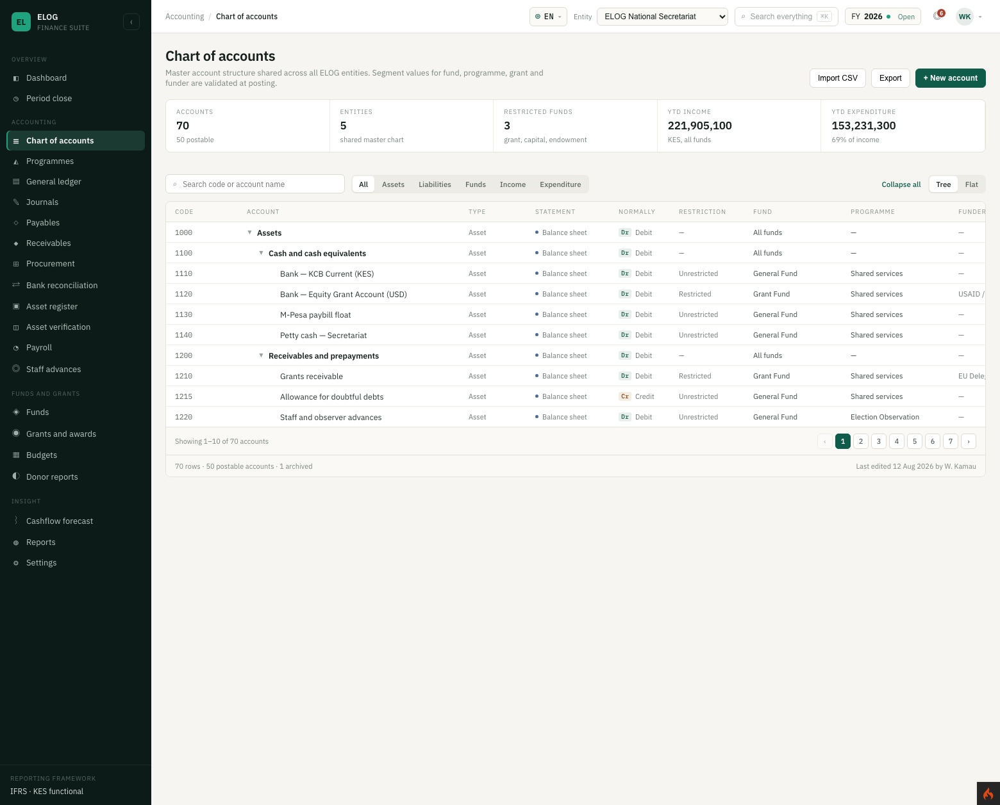

### 2. Reading the page

- **Header** — the title and blurb, with **Import CSV**, **Export** and
  **+ New account** buttons.
- **Stat cards** — Accounts (and how many are postable), Entities, Restricted
  funds, YTD income and YTD expenditure.
- **Toolbar** — a **search** box (code or name), a **type filter** (All, Assets,
  Liabilities, Funds, Income, Expenditure), and on the right an **Expand all /
  Collapse all** link and a **Tree / Flat** toggle.
- **The grid** — one row per account with these columns:

| Column | Meaning |
|--------|---------|
| **Code** | The account number. |
| **Account** | The name, indented under its heading in tree view. |
| **Type** | Asset, Liability, Fund, Income or Expense. |
| **Statement** | Where it reports — Balance sheet or Income & expenditure. |
| **Normally** | Its normal balance — **Dr** (debit) or **Cr** (credit). |
| **Restriction** | Unrestricted, Restricted, etc. |
| **Fund / Programme / Funder** | The default coding dimensions. |
| **YTD balance (KES)** | The year-to-date balance. |
| **Status** | ● Active or ○ Archived. |

- **Footer** — a count of rows, postable accounts and archived accounts, plus who
  last edited the chart and when.

### 3. Finding an account

- **Search** — type a code or name; the list filters as you type.
- **Filter by type** — click a type in the segmented control.
- **Tree vs Flat** — **Tree** shows the account hierarchy with expandable
  headings (click a chevron ▶/▼ to open or close a branch, or use **Expand all /
  Collapse all**). **Flat** shows only the postable accounts as a plain list.
- **Pagination** — the grid shows ten rows a page; use the pager at the foot.

### 4. Viewing or editing an account

Click any account row to open the **account drawer**.

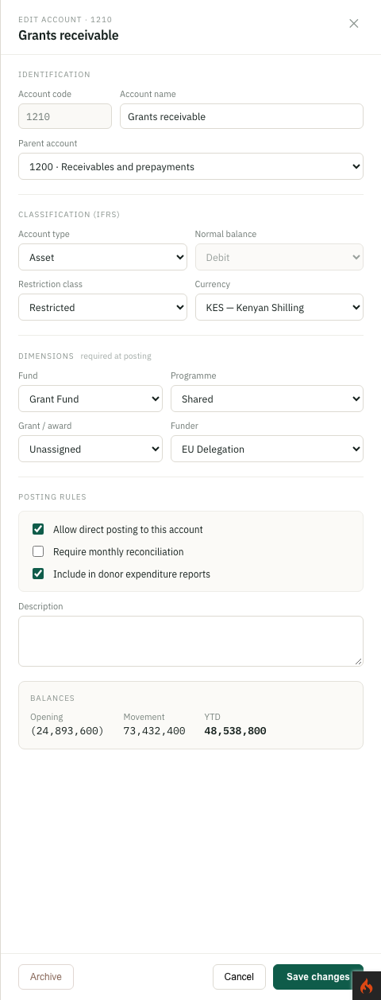

The drawer is organised into sections:

- **Identification** — Account code (read-only when editing an existing account),
  Account name and Parent account.
- **Classification (IFRS)** — Account type, Normal balance (fixed — it follows the
  type), Restriction class and Currency.
- **Dimensions** (required at posting) — Fund, Programme, Grant/award and Funder.
- **Posting rules** — three checkboxes: *Allow direct posting to this account*,
  *Require monthly reconciliation*, and *Include in donor expenditure reports*.
- **Description** — free text.
- **Balances** (when editing) — Opening, Movement and YTD (or a rolled-up total
  for a heading account).

To save, click **Save changes**. If you are not the Finance Manager, the fields
are disabled and a note explains that only the Finance Manager can make changes.

### 5. Adding a new account

1. Click **+ New account** (top right). The drawer opens empty.
2. Enter the **Account code** and **Account name**, and choose the **Parent
   account** it sits under.
3. Set the **Classification** (type, restriction, currency) and the default
   **Dimensions**.
4. Tick the **Posting rules** that apply.
5. Click **Create account**. A toast confirms the account was added.

> Every code must sit under a parent that already exists in the chart.

### 6. Archiving an account

Open an active account and click **Archive** (bottom-left of the drawer). The
account is hidden from new postings, but its historical postings are kept. A toast
confirms *"…archived. Historical postings are retained."*

### 7. Exporting the chart

Click **Export**. The chart downloads as a CSV file. If a search or type filter is
active, only the filtered accounts are exported, and the toast says so.

### 8. Importing accounts from a CSV

Importing runs a **dry run first** — nothing changes until you have reviewed it
and confirmed.

**Step 1 — choose a file.**

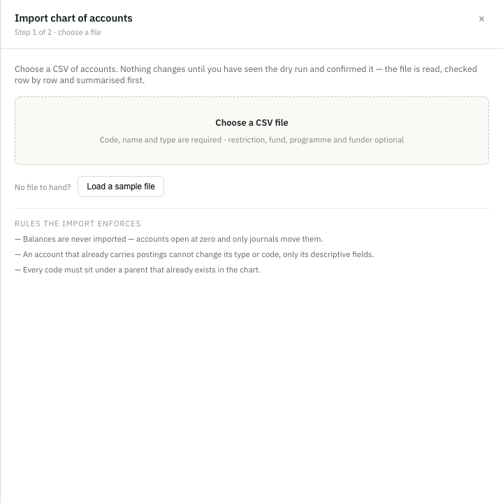

1. Click **Import CSV**. The wizard opens.
2. Click **Choose a CSV file** and pick your file (code, name and type are
   required; restriction, fund, programme and funder are optional). If you just
   want to see how it works, click **Load a sample file**.

The panel also lists the rules the import enforces: balances are never imported;
an account that already carries postings cannot change its type or code; and every
code must sit under an existing parent.

**Step 2 — check the dry run.**

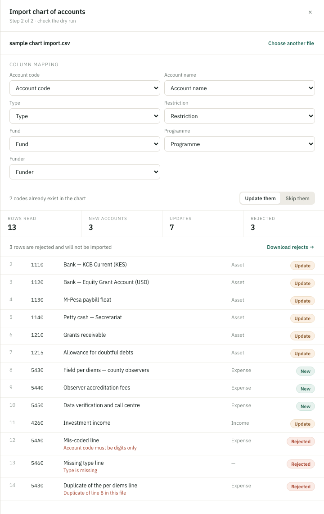

3. Review and, if needed, adjust the **Column mapping** — the wizard matches your
   file's headers to each field automatically.
4. Decide how to treat **codes that already exist**: **Update them** or
   **Skip them**.
5. Read the summary tiles — **Rows read**, **New accounts**, **Updates** and
   **Rejected** — and the per-row preview. Each row is tagged **New**, **Update**,
   **Rejected** (with the reason, e.g. *"Account code must be digits only"*,
   *"Type is missing"*, *"Duplicate of line N in this file"*) or **Skipped**. If
   there are rejects, use **Download rejects →** to get them as a file to fix.
6. When you are satisfied, click the commit button (**Import N accounts**) to
   apply the New and Update rows. Rejected rows are never imported.

Importing is limited to the Finance Manager.

### 9. Quick reference

| I want to… | Do this |
|------------|---------|
| Open the page | Sidebar → **Accounting** → **Chart of accounts** |
| Find an account | Type in **Search**, or filter by **type** |
| See the hierarchy | Use **Tree** view; expand/collapse branches |
| See only postable accounts | Switch to **Flat** view |
| View or edit an account | Click its row → edit in the drawer → **Save changes** |
| Add an account | **+ New account** → fill in → **Create account** |
| Retire an account | Open it → **Archive** |
| Download the chart | **Export** (respects the current filter/search) |
| Bring accounts in from CSV | **Import CSV** → choose file → check dry run → commit |

### 10. Notes and good practice

- **Balances are never typed or imported.** Accounts open at zero and move only
  through journals.
- **Codes are stable.** An existing account's code cannot be changed; nor can the
  type of an account that already carries postings.
- **Normal balance follows the type.** You choose the type; the debit/credit side
  is set for you (contra accounts such as accumulated depreciation take the
  opposite side).
- **Archiving preserves history.** Retire an account by archiving it rather than
  deleting, so past postings remain intact.

---

## Users and roles

**Settings → Users** and **Settings → Roles**. Changing either needs a role with
the `users.manage` permission, which the Finance Manager has out of the box.
Everyone else can look but not change.

### 1. How access works

- A **role** is a named set of permissions, for example *Accountant*: view the
  ledger, prepare journals, raise requisitions.
- People never hold permissions directly. They hold **roles**, as many as their
  job needs, and each role at **all entities** or only the ones named.
- What someone can do is everything their roles allow, added together. Change a
  role's permissions and it changes for everyone who holds it.

### 2. Inviting someone

1. **Settings → Users → Invite user.**
2. Enter their name and work email, tick one or more **roles**, and choose the
   entities they work in.
3. **Send invitation.** They are emailed a link to choose a password. It works
   for seven days. They show as *Invited* until they use it.

### 3. Changing someone's roles

1. **Settings → Users**, then **Manage** on their row.
2. Under **Roles**, change a role in its drop-down, tick **All entities** or the
   entities it applies to, **+ Add a role** for another, or ✕ to take one away.
3. **Save roles.** It takes effect straight away.

From the same drawer you can **Suspend** someone, which signs them out and stops
them signing in, and **Reinstate** them later. You can also **Reset second step**
for someone who has lost their phone and their recovery codes, or email a new
link to someone who hasn't set a password yet.

### 4. Defining roles

1. **Settings → Roles → New role.**
2. Give it a name and a short description, and tick its permissions. They are
   grouped by area: Ledger, Journals and documents, Procurement, Payroll, Period
   close, Chart of accounts and Administration.
3. **Add role.** Add as many roles as the organisation needs.

To change a role, choose **Edit** on its card, then **Save role**. The roles the application comes
with keep their names, because approvals and the close checklist refer to them,
but you can change their permissions. A role you added can be removed with
**Delete role** once nobody holds it.

### 5. Safeguards

- There must always be someone active who can manage users. A change that would
  leave nobody is refused, and so is suspending yourself.
- Everyone must hold at least one role.
- Every change is in **Settings → Audit log**: who changed what, when.

### 6. Quick reference

| Task | How |
|---|---|
| Add a person | Users → **Invite user** → name, email, roles, entities → **Send invitation** |
| Give someone another role | Users → **Manage** → **+ Add a role** → **Save roles** |
| Limit a role to some entities | Users → **Manage** → untick **All entities** → tick the entities |
| Stop someone's access | Users → **Manage** → **Suspend** |
| Someone lost their phone and codes | Users → **Manage** → **Reset second step** |
| Create a role | Roles → **New role** → name, permissions → **Add role** |
| Change what a role can do | Roles → **Edit** on its card → tick or untick permissions → **Save role** |

---

## Supporting documents

An auditor, or a donor checking how their money was spent, picks transactions and
asks for the paper behind each one. The application keeps that paper with the
record. For some records it is required: you cannot go on without it.

### 1. Attaching a document on a form

Forms that take a document show a box headed with what it is for, such as
**Supplier's invoice** or **Receipts**. The box is marked **Required** or
**Recommended**.

1. Click **+ Attach a document** and choose the file. A scan, a photo from your
   phone, or the PDF you were sent is fine. You can choose several at once.
2. The file uploads straight away and appears with its size. While it says
   *Uploading…*, wait before saving.
3. To take a file off, click **✕** next to it.
4. Save the form as usual. The documents are filed with the record.

Accepted: PDF, images (PNG, JPG, GIF, WebP, HEIC), Word, Excel, CSV, text and saved
emails. Each file can be up to 10 MB.

### 2. What is required

| Where | What you must attach | When |
|---|---|---|
| Payables → **+ New bill** | The supplier's invoice | Before **Capture bill** |
| Procurement → **Raise supplier bill** | The supplier's invoice | Before the bill is raised |
| Staff advances → **Surrender with receipts** | The receipts | Before **Post surrender** |
| Grants and awards → **+ Record award** | The signed grant agreement | When **Record as** is **Active**. A **Pipeline** award can be recorded without it. |
| Grants and awards → **Convert to award** | The signed agreement | Attach it on the award first |
| Journals | The supporting document | Before **Submit for approval**, if the entry is over 500,000 or is an **Adjustment**. The editor tells you when this applies. You can save a draft without it. |
| Procurement → quotations | Each supplier's quotation | Above 500,000, only quotations with their document count towards the three required |

If something is missing, the form says what to attach, and nothing is saved.

### 3. What is recommended

These records do not need a document, but have a place for one:

- **Receivables:** the donor's request for the claim, or the claim as sent.
- **Asset register:** the deed of gift, valuation, purchase invoice or title.
- **Asset verification:** a photo of the asset with its tag, or of the damage.
- **Donor reports:** the report as submitted and the donor's acknowledgement.

### 4. Opening a document and adding one later

Open the record: a bill, advance, award, invoice, asset or donor report. Its
documents are listed with who attached them and when. Click one to download it.

To add a document to a record that already exists, for example a signed agreement
that arrived after the award was recorded:

1. Under the documents, click **+ Attach a document** and choose the file.
2. Click **Add to the file**.

Records from before documents were required may say *No supporting document on
file*. Attach the paper when you find it.

A document cannot be removed once it is on a record: it is part of the audit
trail. If the wrong file went on, attach the right one; the history shows both.

### 5. Quick reference

| Task | How |
|---|---|
| Capture a bill | Payables → **+ New bill** → fill in → **+ Attach a document** (the invoice) → **Capture bill** |
| Surrender an advance | Open the advance → **Surrender with receipts** → code the receipts → attach them → **Post surrender** |
| Record a signed award | Grants → **+ Record award** → **Record as: Active** → attach the agreement → continue through the steps |
| Convert a pipeline award | Open the award → **+ Attach a document** → **Add to the file** → **Convert to award** |
| Add paperwork later | Open the record → **+ Attach a document** → **Add to the file** |

